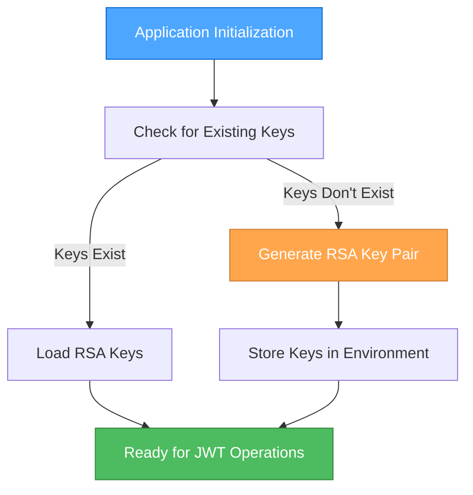
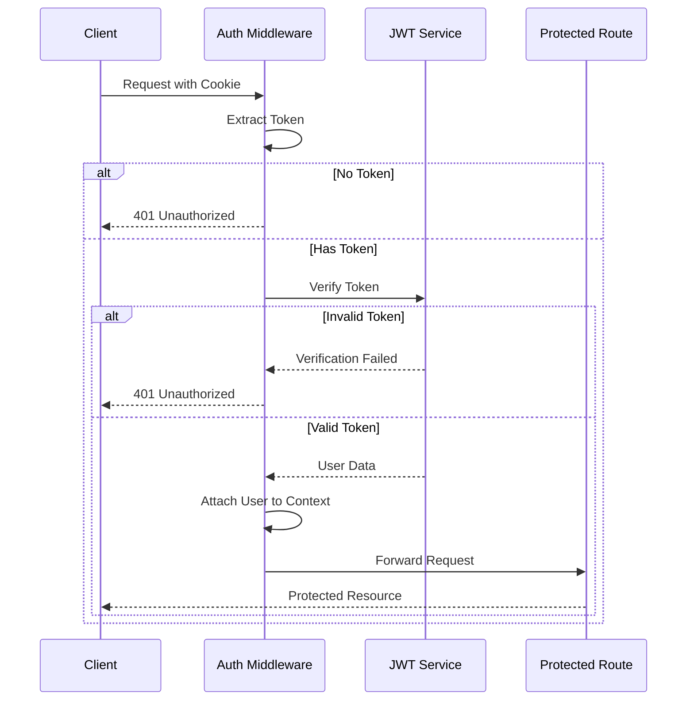

# Algorithm Design: JWT Authentication and Protection Strategy

## Overview
This document outlines the algorithm design decisions for JWT token generation, validation, and protection in our Svelte 5 + Hono + Cloudflare Workers authentication system using asymmetric keys.

## JWT Token Handling

### Key Generation Algorithm
- **Algorithm**: RSA-2048 with SHA-256 (RS256)
- **Key Pair**: Public key for verification, private key for signing
- **Storage**: Private key in Cloudflare Workers Secrets, public key accessible to verification middleware



### Token Generation Process
1. Collect essential user data (user ID, email)
2. Generate payload with claims:
   - Subject (`sub`): User ID
   - Email (`email`): User email
   - Issued at (`iat`): Current timestamp
   - Expiration (`exp`): Current time + 24 hours (configurable)
   - Issuer (`iss`): Our application name
3. Sign payload with private key using RS256 algorithm
4. Return signed JWT

```javascript
async function generateToken(user) {
  const payload = {
    sub: user.id,
    email: user.email,
    iat: Math.floor(Date.now() / 1000),
    exp: Math.floor(Date.now() / 1000) + (60 * 60 * 24), // 24 hours
    iss: 'svelte-hono-auth-app'
  };
  
  return await new jose.SignJWT(payload)
    .setProtectedHeader({ alg: 'RS256' })
    .sign(privateKey);
}
```

### Token Verification Process
1. Extract JWT from HTTP-only cookie
2. Verify token signature using public key
3. Validate token expiration and issuer claims
4. Extract user information from payload
5. Attach user data to request context

```javascript
async function verifyToken(token) {
  try {
    const { payload } = await jose.jwtVerify(token, publicKey, {
      issuer: 'svelte-hono-auth-app',
      clockTolerance: 30 // 30 seconds tolerance for clock skew
    });
    
    return { valid: true, payload };
  } catch (error) {
    return { valid: false, error: error.message };
  }
}
```

## Authentication Middleware

### Protection Flow


### Middleware Implementation
```javascript
// Auth middleware for Hono
export const authMiddleware = async (c, next) => {
  const token = c.req.cookie()['auth_token'];
  
  if (!token) {
    return c.json({ error: 'Authentication required' }, 401);
  }
  
  const { valid, payload, error } = await verifyToken(token);
  
  if (!valid) {
    return c.json({ error: 'Invalid or expired token' }, 401);
  }
  
  // Attach user data to request context
  c.set('user', {
    id: payload.sub,
    email: payload.email
  });
  
  await next();
};
```

## Security Enhancement Algorithms

### Token Refresh Strategy
- Short-lived access tokens (24 hours by default)
- Refresh token excluded for simplicity in this implementation
- Automatic re-authentication required after token expiration

### CSRF Protection
- Implementation of Double Submit Cookie Pattern:
  1. When setting the authentication cookie, also set a CSRF token cookie
  2. Frontend includes CSRF token in header for state-changing requests
  3. Backend validates the header token against the cookie token

```javascript
// CSRF token generation
function generateCSRFToken() {
  return crypto.randomUUID();
}

// CSRF protection middleware
export const csrfProtection = async (c, next) => {
  // Only check for POST, PUT, DELETE requests
  if (['POST', 'PUT', 'DELETE'].includes(c.req.method)) {
    const csrfCookie = c.req.cookie()['csrf_token'];
    const csrfHeader = c.req.header('X-CSRF-Token');
    
    if (!csrfCookie || !csrfHeader || csrfCookie !== csrfHeader) {
      return c.json({ error: 'CSRF verification failed' }, 403);
    }
  }
  
  await next();
};
```

### Cookie Security Settings
```javascript
function setAuthCookie(c, token) {
  c.cookie('auth_token', token, {
    httpOnly: true,
    secure: true,
    sameSite: 'strict',
    path: '/',
    maxAge: 60 * 60 * 24 // 24 hours
  });
  
  const csrfToken = generateCSRFToken();
  c.cookie('csrf_token', csrfToken, {
    httpOnly: false, // Must be accessible to JS
    secure: true,
    sameSite: 'strict',
    path: '/',
    maxAge: 60 * 60 * 24 // 24 hours
  });
  
  return csrfToken;
}
```

## Password Handling

### Password Hashing Algorithm
- **Algorithm**: bcrypt
- **Work Factor**: 12 (configurable based on environment)
- **Implementation**:

```javascript
// Hash password
async function hashPassword(password) {
  const salt = await bcrypt.genSalt(12);
  return await bcrypt.hash(password, salt);
}

// Verify password
async function verifyPassword(password, hash) {
  return await bcrypt.compare(password, hash);
}
```

### Password Strength Requirements
- Minimum 8 characters
- Contains at least one uppercase letter
- Contains at least one lowercase letter
- Contains at least one number
- Contains at least one special character

```javascript
function isStrongPassword(password) {
  const minLength = password.length >= 8;
  const hasUppercase = /[A-Z]/.test(password);
  const hasLowercase = /[a-z]/.test(password);
  const hasNumber = /[0-9]/.test(password);
  const hasSpecial = /[!@#$%^&*()_+\-=\[\]{};':"\\|,.<>\/?]/.test(password);
  
  return minLength && hasUppercase && hasLowercase && hasNumber && hasSpecial;
}
```

## Edge Cases and Error Handling

### Token Compromised
- No explicit revocation mechanism in this implementation
- Mitigation through short token lifetime
- User password change invalidates old tokens (user ID in token remains the same, but server validation checks if action is allowed)

### Service Errors
- Clear error messages without revealing system details
- Consistent error format across all authentication endpoints
- Logging of errors with appropriate level of detail for debugging

### Rate Limiting
- Implementation of request rate limiting to prevent brute force attacks
- Using Cloudflare Workers native rate limiting or custom implementation

```javascript
// Simplified rate limiting example
const ipLimiter = new Map();

export const rateLimitMiddleware = async (c, next) => {
  const ip = c.req.headers.get('CF-Connecting-IP') || 'unknown';
  const now = Date.now();
  
  if (!ipLimiter.has(ip)) {
    ipLimiter.set(ip, { count: 1, resetAt: now + 60000 }); // 1 minute window
  } else {
    const limit = ipLimiter.get(ip);
    
    if (now > limit.resetAt) {
      ipLimiter.set(ip, { count: 1, resetAt: now + 60000 });
    } else if (limit.count >= 5) { // Max 5 requests per minute
      return c.json({ error: 'Too many requests' }, 429);
    } else {
      limit.count++;
    }
  }
  
  await next();
};
```

## API Security Headers

```javascript
// Security headers middleware
export const securityHeadersMiddleware = async (c, next) => {
  await next();
  
  // Add security headers to the response
  c.header('Content-Security-Policy', "default-src 'self'");
  c.header('X-Content-Type-Options', 'nosniff');
  c.header('X-Frame-Options', 'DENY');
  c.header('X-XSS-Protection', '1; mode=block');
  c.header('Strict-Transport-Security', 'max-age=31536000; includeSubDomains');
  c.header('Referrer-Policy', 'strict-origin-when-cross-origin');
};
```

## Algorithm Complexity Analysis

| Operation | Time Complexity | Space Complexity | Notes |
|-----------|----------------|------------------|-------|
| Token Generation | O(1) | O(1) | Constant time operation |
| Token Validation | O(1) | O(1) | Constant time verification |
| Password Hashing | O(2^n) | O(1) | Intentionally slow for security |
| Password Verification | O(2^n) | O(1) | Intentionally slow for security |
| CSRF Token Generation | O(1) | O(1) | UUID generation is constant time |
| Rate Limiting | O(1) | O(n) | n = number of unique IPs |

## Implementation Notes

- Use `jose` library for JWT operations (modern, well-maintained)
- Use `bcryptjs` for password hashing (proven security)
- Store JWT-related secrets in Cloudflare Workers Secrets
- Implement proper error handling throughout the authentication flow
- Apply rate limiting to sensitive endpoints (login, signup)
- Use HTTP-only cookies with secure flags for token storage 