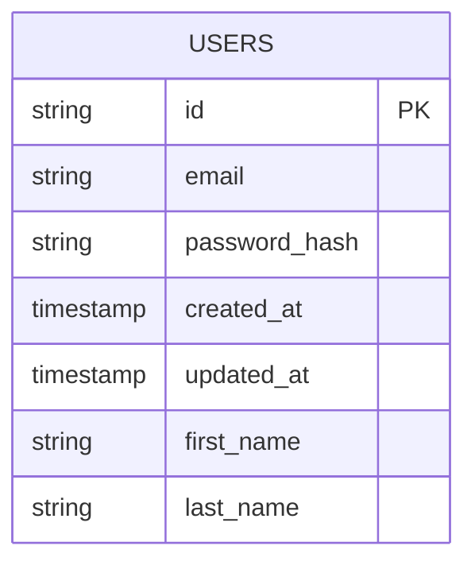
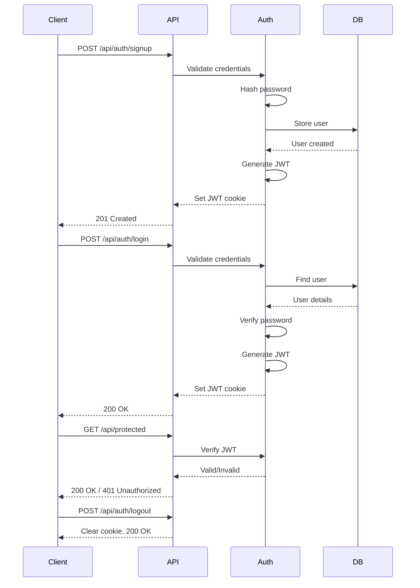

# Architecture Decision Record: Authentication System

## Context
- System Requirements:
  - User authentication (signup, login, logout)
  - Secure credential storage
  - Token-based authentication with asymmetric keys
  - Database persistence with Cloudflare D1
  - ORM integration with Drizzle
  - Modern UI with Tailwind CSS
- Technical Constraints:
  - Cloudflare Workers environment
  - Svelte 5 with Runes for frontend
  - Hono for backend API
  - Single worker serving both frontend and API

## Component Analysis
- Core Components:
  - Database Layer: Manages user data persistence using D1 and Drizzle ORM
  - Auth API: Handles authentication requests and token management
  - Auth Middleware: Validates JWT tokens and protects routes
  - Frontend Components: User-facing authentication forms and interfaces
  - State Management: Manages authentication state in the Svelte app

- Interactions:
  - User → Frontend → Auth API → Database
  - Protected Routes → Auth Middleware → Frontend
  - Auth API → JWT Service → Frontend

## Architecture Options

### Option 1: Cookie-Based JWT Authentication
- Description: Store JWT in HTTP-only cookie, validate on server
- Pros:
  - Secure against XSS attacks (HTTP-only cookie)
  - Automatic inclusion with requests (no manual token handling)
  - Works well with Cloudflare Workers
- Cons:
  - Requires proper CORS configuration
  - Cookie size limitations
  - Requires careful cookie security settings
- Technical Fit: High
- Complexity: Medium
- Scalability: High

### Option 2: Local Storage JWT with Bearer Token
- Description: Store JWT in localStorage, send as Authorization header
- Pros:
  - Simple implementation
  - Works across domains
  - No cookie limitations
- Cons:
  - Vulnerable to XSS attacks
  - Requires manual token management
  - More client-side handling
- Technical Fit: Medium
- Complexity: Low
- Scalability: High

### Option 3: Hybrid Approach (Short-lived access token + Refresh token)
- Description: Short-lived access token in memory, refresh token in HTTP-only cookie
- Pros:
  - Enhanced security (access token not persisted)
  - Improved user experience (silent refresh)
  - Reduced token exposure
- Cons:
  - Higher implementation complexity
  - More server-side processing
  - More complex state management
- Technical Fit: Medium
- Complexity: High
- Scalability: High

## Decision
- Chosen Option: Cookie-Based JWT Authentication (Option 1)
- Rationale: 
  - Best security profile for this application
  - Simplicity of implementation within Cloudflare Workers
  - Good fit with the existing Hono/Svelte architecture
  - Avoids XSS vulnerabilities associated with localStorage
- Implementation Considerations:
  - Configure secure, HTTP-only, SameSite cookies
  - Implement CSRF protection
  - Use asymmetric keys (RS256) for token signing/verification
  - Store private key securely in Cloudflare Workers environment

## Database Design


## Authentication Flow


## JWT Structure
- Header:
  ```json
  {
    "alg": "RS256",
    "typ": "JWT"
  }
  ```
- Payload:
  ```json
  {
    "sub": "<user_id>",
    "email": "<user_email>",
    "iat": "<issued_at>",
    "exp": "<expires_at>"
  }
  ```

## API Routes
- Authentication:
  - `POST /api/auth/signup` - Create new user
  - `POST /api/auth/login` - Authenticate user
  - `POST /api/auth/logout` - End user session
  - `GET /api/auth/me` - Get current user info
- Protected Resources:
  - `GET /api/users/profile` - Get user profile data

## Validation
- Requirements Met:
  - ✓ Secure credential storage (bcrypt)
  - ✓ Token-based authentication (JWT)
  - ✓ Database persistence (D1 + Drizzle)
  - ✓ Frontend integration (Svelte components)
- Technical Feasibility: High
- Risk Assessment: Low to Medium
  - Key risks: Proper key management, CORS configuration 