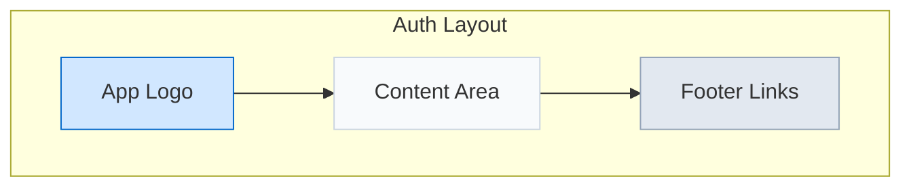
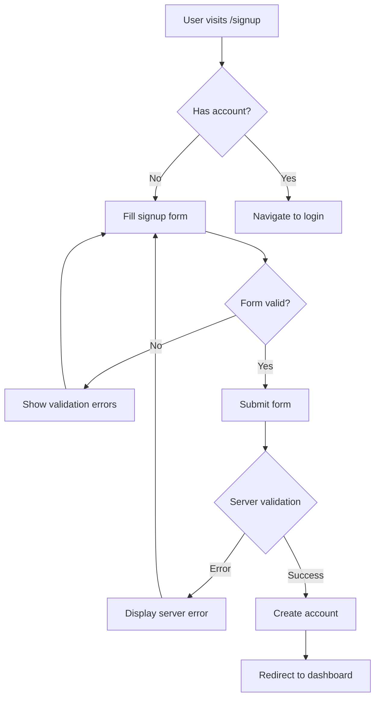
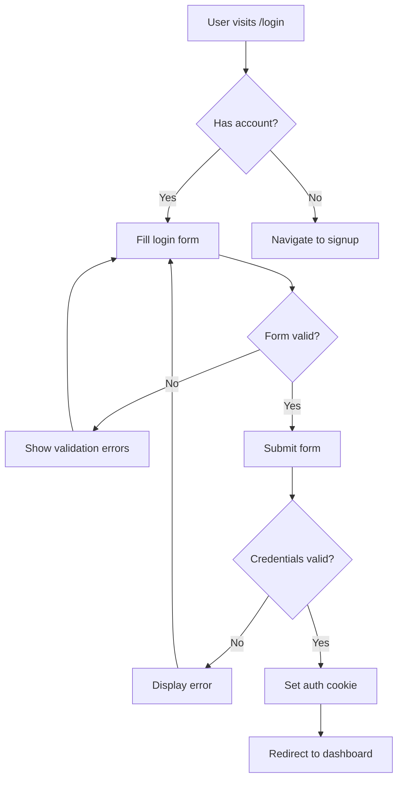

# UI/UX Design: Authentication System

## Overview
This document outlines the UI/UX design decisions for the authentication system in our Svelte 5 + Hono + Cloudflare Workers application. The design aims to be clean, responsive, and user-friendly while leveraging Tailwind CSS for styling.

## Design Principles
- **Simplicity**: Clean, minimalist interfaces with clear call-to-actions
- **Responsiveness**: Fully responsive design that works well on all devices
- **Feedback**: Immediate visual feedback for user actions and form validations
- **Accessibility**: WCAG-compliant color contrast and semantic HTML
- **Consistency**: Uniform styling across all authentication components

## Component Design

### 1. Auth Layout
- Shared layout for all authentication pages
- Centered card layout with subtle shadow
- App logo/branding at the top
- Background with subtle gradient



### 2. Signup Form
- Email field with validation
- Password field with strength indicator
- Confirm password field
- First name and last name fields
- Terms of service agreement checkbox
- Signup button with loading state
- Link to login page

### 3. Login Form
- Email field with validation
- Password field
- Remember me checkbox
- Login button with loading state
- Forgot password link
- Link to signup page

### 4. Form Validation
- Real-time validation as user types
- Clear error messages below invalid fields
- Visual indicators of field status (valid/invalid)
- Form-level error messages for server errors

### 5. Profile Page
- User information display
- Option to update profile information
- Password change functionality
- Account deletion option
- Session management

## UI Components

### Form Inputs
```html
<div class="mb-4">
  <label for="email" class="block text-sm font-medium text-gray-700 mb-1">Email</label>
  <input
    type="email"
    id="email"
    class="w-full px-3 py-2 border border-gray-300 rounded-md shadow-sm focus:outline-none focus:ring-2 focus:ring-blue-500 focus:border-blue-500"
    placeholder="you@example.com"
  />
  <p class="mt-1 text-sm text-red-600 hidden">Please enter a valid email address</p>
</div>
```

### Buttons
```html
<button
  type="submit"
  class="w-full flex justify-center py-2 px-4 border border-transparent rounded-md shadow-sm text-sm font-medium text-white bg-blue-600 hover:bg-blue-700 focus:outline-none focus:ring-2 focus:ring-offset-2 focus:ring-blue-500"
>
  <span>Sign Up</span>
  <!-- Loading spinner shown during form submission -->
  <svg class="animate-spin ml-2 h-4 w-4 text-white hidden" xmlns="http://www.w3.org/2000/svg" fill="none" viewBox="0 0 24 24">
    <circle class="opacity-25" cx="12" cy="12" r="10" stroke="currentColor" stroke-width="4"></circle>
    <path class="opacity-75" fill="currentColor" d="M4 12a8 8 0 018-8V0C5.373 0 0 5.373 0 12h4zm2 5.291A7.962 7.962 0 014 12H0c0 3.042 1.135 5.824 3 7.938l3-2.647z"></path>
  </svg>
</button>
```

### Error Messages
```html
<div class="rounded-md bg-red-50 p-4 mb-4">
  <div class="flex">
    <div class="flex-shrink-0">
      <svg class="h-5 w-5 text-red-400" xmlns="http://www.w3.org/2000/svg" viewBox="0 0 20 20" fill="currentColor">
        <path fill-rule="evenodd" d="M10 18a8 8 0 100-16 8 8 0 000 16zM8.707 7.293a1 1 0 00-1.414 1.414L8.586 10l-1.293 1.293a1 1 0 101.414 1.414L10 11.414l1.293 1.293a1 1 0 001.414-1.414L11.414 10l1.293-1.293a1 1 0 00-1.414-1.414L10 8.586 8.707 7.293z" clip-rule="evenodd" />
      </svg>
    </div>
    <div class="ml-3">
      <h3 class="text-sm font-medium text-red-800">Invalid credentials</h3>
    </div>
  </div>
</div>
```

## Responsive Design
- Mobile-first approach
- Breakpoints:
  - Default: Mobile (320px+)
  - sm: Tablets (640px+)
  - md: Small laptops (768px+)
  - lg: Laptops/Desktops (1024px+)

## Color System
- Primary: Blue (#3B82F6)
- Success: Green (#10B981)
- Error: Red (#EF4444)
- Warning: Amber (#F59E0B)
- Info: Sky (#0EA5E9)
- Neutral: Gray (#64748B)
- Background: Light gray (#F8FAFC)
- Text: Dark gray (#1F2937)

## User Flows

### Signup Flow


### Login Flow


## Animation and Transitions
- Subtle form field transitions on focus
- Loading spinners for async operations
- Smooth transitions between auth states
- Form submission feedback animations

## Implementation Considerations
- Use Svelte 5 reactive state for form handling
- Implement form validation using custom validators or libraries
- Use Tailwind CSS for styling all components
- Create reusable components for inputs, buttons, and error messages
- Implement proper focus management for accessibility

## Mockups

### Login Page Layout
```
+----------------------------------------+
|                                        |
|                [LOGO]                  |
|                                        |
|  +----------------------------------+  |
|  |            Login                 |  |
|  |                                  |  |
|  |  Email:                          |  |
|  |  +----------------------------+  |  |
|  |  |                            |  |  |
|  |  +----------------------------+  |  |
|  |                                  |  |
|  |  Password:                       |  |
|  |  +----------------------------+  |  |
|  |  |                            |  |  |
|  |  +----------------------------+  |  |
|  |                                  |  |
|  |  [X] Remember me                 |  |
|  |                                  |  |
|  |  +----------------------------+  |  |
|  |  |          LOGIN            |  |  |
|  |  +----------------------------+  |  |
|  |                                  |  |
|  |  Don't have an account?          |  |
|  |  [Sign up here]                  |  |
|  |                                  |  |
|  +----------------------------------+  |
|                                        |
+----------------------------------------+
```

### Signup Page Layout
```
+----------------------------------------+
|                                        |
|                [LOGO]                  |
|                                        |
|  +----------------------------------+  |
|  |            Sign Up               |  |
|  |                                  |  |
|  |  First Name:                     |  |
|  |  +----------------------------+  |  |
|  |  |                            |  |  |
|  |  +----------------------------+  |  |
|  |                                  |  |
|  |  Last Name:                      |  |
|  |  +----------------------------+  |  |
|  |  |                            |  |  |
|  |  +----------------------------+  |  |
|  |                                  |  |
|  |  Email:                          |  |
|  |  +----------------------------+  |  |
|  |  |                            |  |  |
|  |  +----------------------------+  |  |
|  |                                  |  |
|  |  Password:                       |  |
|  |  +----------------------------+  |  |
|  |  |                            |  |  |
|  |  +----------------------------+  |  |
|  |                                  |  |
|  |  Confirm Password:               |  |
|  |  +----------------------------+  |  |
|  |  |                            |  |  |
|  |  +----------------------------+  |  |
|  |                                  |  |
|  |  [X] I agree to the Terms of     |  |
|  |      Service and Privacy Policy  |  |
|  |                                  |  |
|  |  +----------------------------+  |  |
|  |  |         SIGN UP           |  |  |
|  |  +----------------------------+  |  |
|  |                                  |  |
|  |  Already have an account?        |  |
|  |  [Log in here]                   |  |
|  |                                  |  |
|  +----------------------------------+  |
|                                        |
+----------------------------------------+
``` 